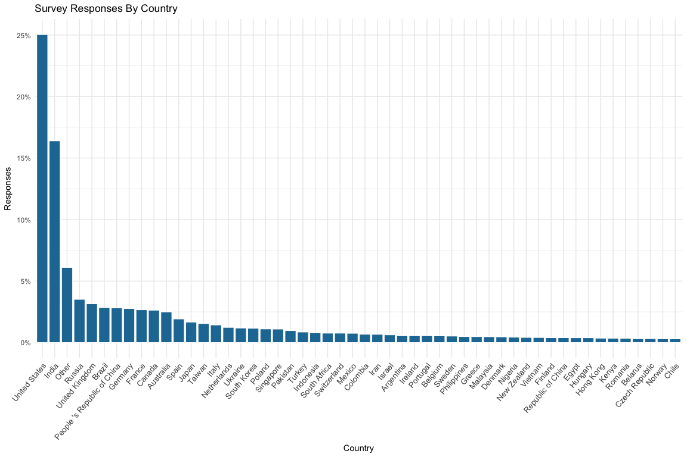
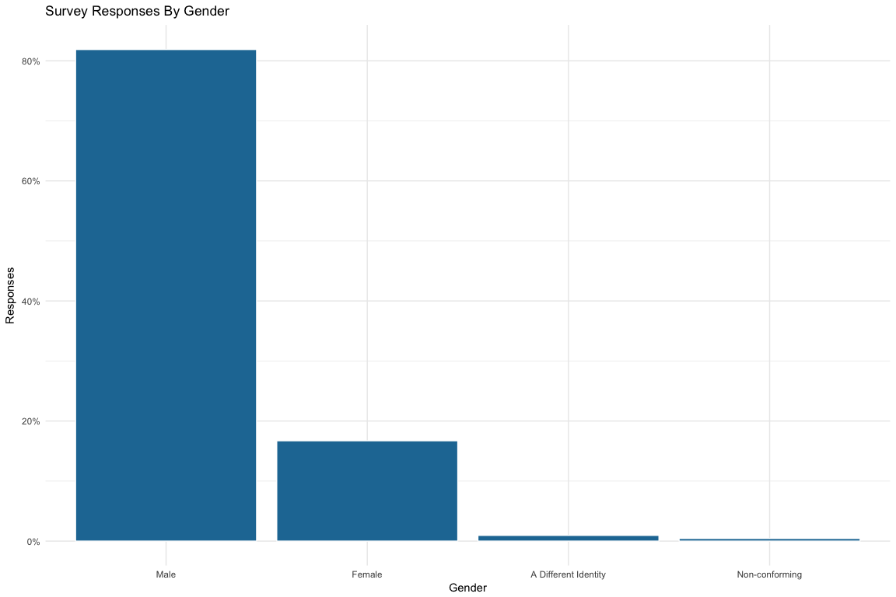
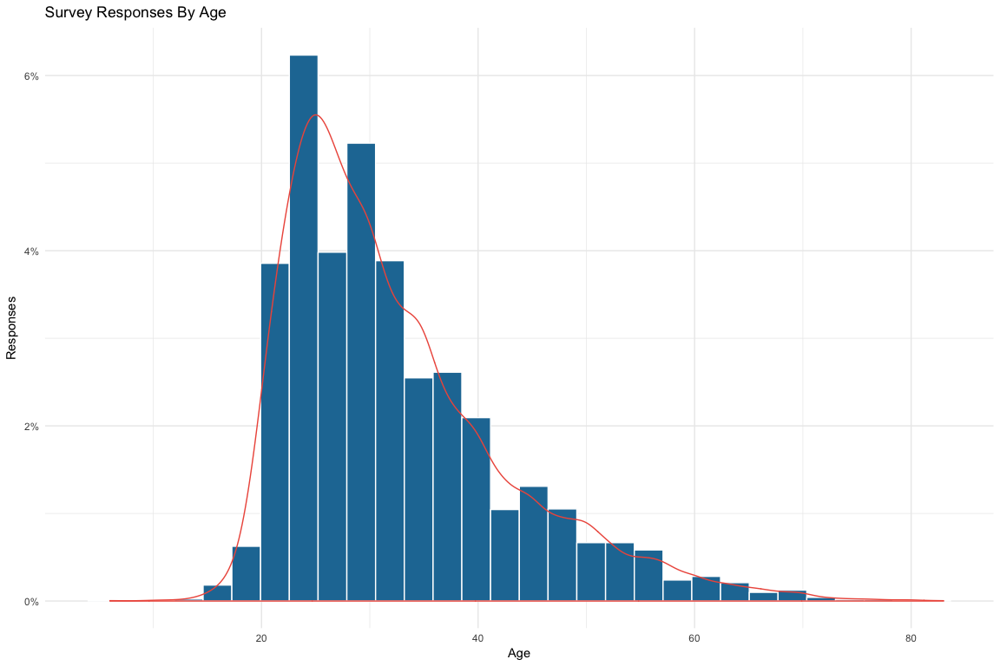
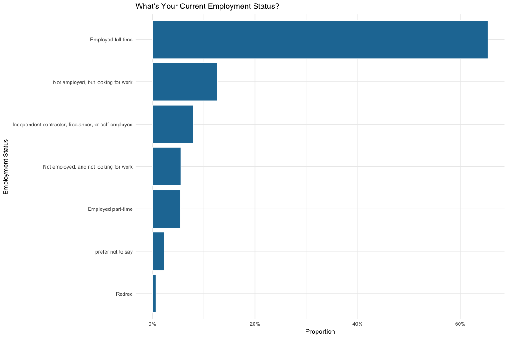

Kaggle Survey 2017
================
Josh Goldberg
11/7/2017

Load Libraries
--------------

Read Data
---------

We'll start with a quick glimpse of the data.

    ## [1] 16716   228

This dataset has 16,716 rows (survey entries) and 228 columns.

Create clean data frame to manipulate.

Response by Country
-------------------

*Excluded NA* 

Response by Gender
------------------

*Excluded NA* 

Response by Country and Gender
------------------------------

*Excluded NA* 

Age Distribution
----------------

*Ages between 5 and 90; Excluded NA* 

Age Distribution by Gender
--------------------------

*Ages between 5 and 90; Excluded NA* 

Age Distribution of Top 10% Quantile Countries
----------------------------------------------

*Ages between 5 and 90; Excluded NA* If a country or territory received less than 50 respondents, they are grouped into a group named “Other” for anonymity.

``` r
top_tenQ_countries <- MC_group(Country) %>%
  filter(count >= quantile(count, 0.90))

ggplot(filter(clean_MC_data, !is.na(Age), !is.na(GenderSelect), Age > 5 & Age < 90,
              Country %in% ((top_tenQ_countries$Country))) +
  geom_histogram(aes(x = Age, y = ..density..), fill = '#2178a3', color = 'white') +
  geom_density(aes(x = Age, color = I('#ee5b4b'))) +
  guides(color = "none") +
  scale_y_continuous(labels = percent) +
  facet_wrap(~ Country) +
  labs(x = 'Age', y = 'Responses',
       title = 'Age Distribution of Top 10% Quantile Countries') +
  theme_minimal()
```

    ## Error: <text>:14:0: unexpected end of input
    ## 12:        title = 'Age Distribution of Top 10% Quantile Countries') +
    ## 13:   theme_minimal()
    ##    ^

Age Distribution of Top 10% Quantile Countries by Male/Female
-------------------------------------------------------------

*Ages between 5 and 90; Excluded NA* If a country or territory received less than 50 respondents, they are grouped into a group named “Other” for anonymity.

``` r
ggplot(filter(clean_MC_data, !is.na(Age), !is.na(GenderSelect), 
              GenderSelect %in% (c('Male', 'Female')), Age > 5 & Age < 90,
              Country %in% ((top_tenQ_countries$Country)) +
  geom_histogram(aes(x = Age, y = ..density..), fill = '#2178a3', color = 'white') +
  geom_density(aes(x = Age, color = I('#ee5b4b'))) +
  guides(color = "none") +
  scale_y_continuous(labels = percent) +
  facet_grid(GenderSelect ~ Country) +
  labs(x = 'Age', y = 'Responses',
       title = 'Age Distribution of Top 10% Quantile Countries by Male/Female') +
  theme_minimal()
```

    ## Error: <text>:12:0: unexpected end of input
    ## 10:        title = 'Age Distribution of Top 10% Quantile Countries by Male/Female') +
    ## 11:   theme_minimal()
    ##    ^

Employment Status
-----------------


