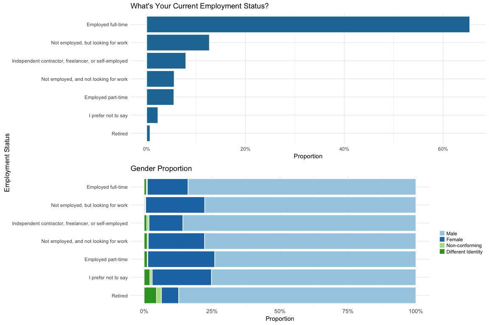

Kaggle Survey 2017
================
Josh Goldberg
11/7/2017

Load Libraries
--------------

``` r
library(tidyverse)
library(gridExtra)
library(scales)
library(forcats)
library(rlang)
library(RColorBrewer)
library(viridis)
library(knitr)
```

Read Data
---------

``` r
MC_raw_data <- read_csv('multipleChoiceResponses.csv')
FF_raw_data <- read_csv('freeformResponses.csv')
schema <- read_csv('schema.csv')
conversion_rates <- read_csv('conversionRates.csv')
```

We'll start with a quick glimpse of the data.

``` r
dim(MC_raw_data)
```

    ## [1] 16716   228

This dataset has 16,716 rows (survey entries) and 228 columns.

Create clean data frame to manipulate.

``` r
clean_MC_data <- MC_raw_data

clean_MC_data <- filter(clean_MC_data, !is.na(GenderSelect), !is.na(Country), !is.na(Age), !is.na(EmploymentStatus), Age > 5 & Age < 90)

# order country by frequency
clean_MC_data$Country <- fct_infreq(clean_MC_data$Country)

# add factor, levels, and label to Gender MC
clean_MC_data$GenderSelect <- factor(clean_MC_data$GenderSelect, 
                                     levels = c('Male', 'Female', 
                                                'Non-binary, genderqueer, or gender non-conforming', 
                                                'A different identity'),
                                     labels = c('Male', 'Female', 
                                                'Non-conforming', 'Different Identity'))
clean_FF_data <- FF_raw_data
```

``` r
MC_group <- function(question, df = clean_MC_data) {
  question <- enquo(question)
  df %>% 
    filter(!is.na(!!question)) %>%
    group_by(!!question) %>% 
    summarise(count = n()) %>% 
    mutate(percent = count / sum(count) * 100) %>% 
    arrange(desc(count))
}
```

Response by Country
-------------------

*Excluded NA*

``` r
ggplot(clean_MC_data) +
  geom_bar(aes(x = fct_infreq(Country), y = ..prop.., group = 1), fill = '#2178a3', color = 'white') +
  labs(x = 'Country', y = 'Responses',
       title = 'Survey Responses By Country') +
  scale_y_continuous(labels = percent) +
  theme(plot.title = element_text(size = 14, face = "bold",
                                       color = "black", vjust = -1)) +
  theme(plot.subtitle = element_text(size = 8, face = "italic",
                                          color = "black")) +
  theme(axis.text.x = element_text(size = 10, angle = 50, hjust = 1)) +
  theme(axis.title.x = element_text(size = 10, vjust = -0.2)) +
  theme(axis.title.y = element_text(size = 10)) +
  theme(panel.background = element_rect(fill = "white")) +
  theme_minimal() +
  theme(axis.text.x = element_text(size = 10, angle = 50, hjust = 1))
```


Response by Gender
------------------

*Excluded NA*

``` r
ggplot(clean_MC_data) +
  geom_bar(aes(x = fct_infreq(GenderSelect), y = ..prop.., group = 1), fill = '#2178a3', color = 'white') +
  labs(x = 'Gender', y = 'Responses',
       title = 'Survey Responses By Gender') +
  scale_y_continuous(labels = percent) +
  scale_x_discrete(labels = c('Male', 'Female', 'A Different Identity', 'Non-conforming')) +
  theme(plot.title = element_text(size = 14, face = "bold",
                                       color = "black", vjust = -1)) +
  theme(plot.subtitle = element_text(size = 8, face = "italic",
                                          color = "black")) +
  theme(axis.text.x = element_text(size = 10, angle = 50, hjust = 1)) +
  theme(axis.title.x = element_text(size = 10, vjust = -0.2)) +
  theme(axis.title.y = element_text(size = 10)) +
  theme(panel.background = element_rect(fill = "white")) +
  theme_minimal() 
```


Response by Country and Gender
------------------------------

*Excluded NA*

``` r
ggplot(clean_MC_data) +
  geom_bar(aes(x = fct_infreq(Country), fill = GenderSelect), position = 'fill') +
  labs(x = 'Country', y = 'Proportion',
       title = 'Survey Responses by Country and Gender') +
  scale_y_continuous(labels = percent) +
  scale_fill_brewer(type = 'qual', palette = 3, direction = 1,
                    guide = guide_legend(title = NULL, keywidth = .75, keyheight = .75), name = 'Gender') +
  theme_minimal() +
  theme(legend.position = "top") +
  theme(axis.text.x = element_text(size = 10, angle = 50, hjust = 1))
```


Age Distribution
----------------

*Ages between 5 and 90; Excluded NA*

``` r
ggplot(clean_MC_data) +
  geom_histogram(aes(x = Age, y = ..density..), fill = '#2178a3', color = 'white') +
  geom_density(aes(x = Age, color = I('#ee5b4b'))) +
  guides(color = "none") +
  scale_y_continuous(labels = percent) +
  labs(x = 'Age', y = 'Responses',
       title = 'Survey Responses By Age') +
  theme_minimal()
```


Age Distribution by Gender
--------------------------

*Ages between 5 and 90; Excluded NA*

``` r
ggplot(filter(clean_MC_data, !is.na(Age), !is.na(GenderSelect), Age > 5 & Age < 90)) +
  geom_histogram(aes(x = Age, y = ..density..), bins = 50, fill = '#2178a3', color = 'white') +
  geom_density(aes(x = Age, color = I('#ee5b4b'))) +
  guides(color = "none") +
  facet_wrap(~ GenderSelect) +
  scale_y_continuous(labels = percent) +
  labs(x = 'Age', y = 'Responses',
       title = 'Survey Responses By Gender and Age') +
  theme_minimal()
```


Age Distribution of Top 10% Quantile Countries
----------------------------------------------

*Ages between 5 and 90; Excluded NA*

If a country or territory received less than 50 respondents, they are grouped into a group named “Other” for anonymity.

``` r
top_tenQ_countries <- (MC_group(Country) %>%
  filter(count >= quantile(count, 0.90)))

ggplot(filter(clean_MC_data, Country %in% (top_tenQ_countries$Country))) +
  geom_histogram(aes(x = Age, y = ..density..), fill = '#2178a3', color = 'white') +
  geom_density(aes(x = Age, color = I('#ee5b4b'))) +
  guides(color = "none") +
  scale_y_continuous(labels = percent) +
  facet_wrap(~ Country) +
  labs(x = 'Age', y = 'Responses',
       title = 'Age Distribution of Top 10% Quantile Countries') +
  theme_minimal()
```


Age Distribution of Top 10% Quantile Countries by Male/Female
-------------------------------------------------------------

*Ages between 5 and 90; Excluded NA*

If a country or territory received less than 50 respondents, they are grouped into a group named “Other” for anonymity.

``` r
ggplot(filter(clean_MC_data, GenderSelect %in% c('Male', 'Female'),
              Country %in% (top_tenQ_countries$Country))) +
  geom_histogram(aes(x = Age, y = ..density..), fill = '#2178a3', color = 'white') +
  geom_density(aes(x = Age, color = I('#ee5b4b'))) +
  guides(color = "none") +
  scale_y_continuous(labels = percent) +
  facet_grid(GenderSelect ~ Country) +
  labs(x = 'Age', y = 'Responses',
       title = 'Age Distribution of Top 10% Quantile Countries by Male/Female') +
  theme_minimal()
```


Employment Status
-----------------

``` r
EmploymentStatus <- MC_group(EmploymentStatus)

ggplot(EmploymentStatus) +
  geom_col(aes(x = reorder(EmploymentStatus, count), y = percent / 100), fill = '#2178a3', color = 'white') +
  guides(color = "none") +
  scale_y_continuous(labels = percent) +
  coord_flip() +
  labs(x = 'Employment Status', y = 'Proportion',
       title = "What's Your Current Employment Status?") +
  theme_minimal()
```


